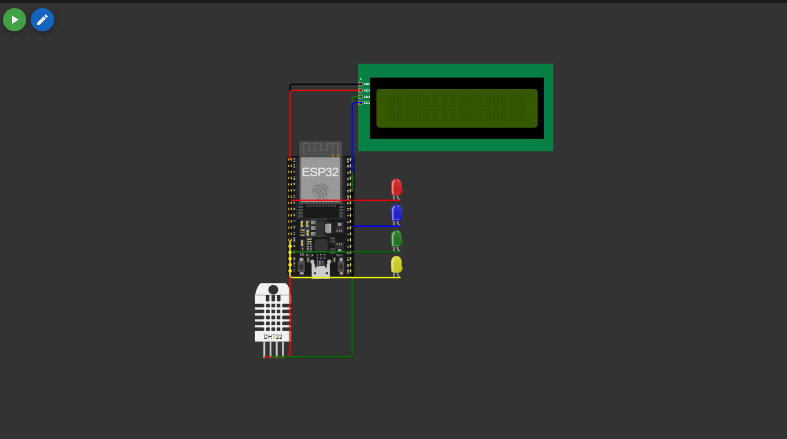

# FIAP - Faculdade de Informática e Administração Paulista 

<p align="center">
<a href= "https://www.fiap.com.br/"></a>
</p>

<br>

# 🌿 Construindo Máquina Agrícola Inteligente - Fase 4


## Grupo 6

## 👨‍🎓 Integrantes: 
| Matrícula                 | Aluno               						  |
|---------------------------|---------------------------------------------|
|        RM 565150          | Andre de Oliveira Santos Burger			  |
|        RM 565497          | Vera Maria Chaves de Souza				  | 
|        RM 565286          | Diogo Rebello dos Santos					  |
|        RM 565555          | Marcos Vinícius dos Santos Fernandes		  |


## 👩‍🏫 Professores:
### Tutor(a) 
- <a href="#">Leonardo Ruiz Orabona</a>
### Coordenador(a)
- <a href="#">André Godoi Chiovato</a>


## 📜 Descrição

Projeto acadêmico dividido em duas fases principais: **coleta de dados ambientais com ESP32** e **armazenamento/processamento via API Flask com banco SQL**. O objetivo é aplicar conceitos de automação, IoT e persistência de dados para ambientes agrícolas.

## 📁 Estrutura de pastas

```
assets/
|── simulacao_esp32.png
│
src/
├── sensores/
│   └── main.ino
│
├── api_crud/
│   ├── app.py
│   └── requirements.txt
│
├── dashboard/
│   ├── app.py
│   └── requirements.txt
│
├── machine_learning/
│   ├── predict_model.py
│   ├── train_model.py
│   ├── modelo_irrigacao.pkl
│   └── requirements.txt
│
├── .gitignore
└── README.md
```

## 🚀 Sistema de Sensores e Controle com ESP32

Nesta primeira fase, desenvolvemos um sistema de monitoramento e automação para plantio inteligente utilizando o ESP32 e sensores simulados.

### ✅ Metas:

- Construção do circuito de sensores no [Wokwi](https://wokwi.com/)
- Código em C/C++ utilizando PlatformIO
- Acionamento automático de um relé (bomba de irrigação)
- Comentários no código explicando a lógica
- Registro e documentação da montagem no README

### 🔌 Componentes simulados:

- Sensor de umidade
- Sensor de pH
- Relé de irrigação
- ESP32 DevKit v1

### 🖼️ Circuito no Wokwi:



### 📂 Entregáveis:

- `main.ino` com o código completo e comentado
- `simulacao_esp32.png` com a imagem do circuito
- Documentação explicando o funcionamento

---

## 💾 Armazenamento de Dados em Banco MySQL com Python

A segunda fase consiste em simular o envio dos dados dos sensores para um sistema de banco de dados por meio de uma API RESTful em Python com Flask.

### 🗃️ Banco de Dados:
Banco de dados usado foi um MySQL.
- `/assets/MODELO_BANCO.sql` - Modelo do Dump do Banco de Dados
- `/assets/APRIMORAMENTO.sql` - Arquivo .sql com as melhorias feitas no banco de dados.

### ✅ Metas:

- Captura de dados do ESP32 por requisições HTTP
- API Flask conectada a um banco MySQL
- CRUD completo: inserção, consulta, atualização e exclusão
- Justificativa das tabelas utilizadas com base no MER da Fase 2
- Documentação com exemplos e justificativas

### 📘 Endpoints disponíveis:

- `/produtores` - Cadastro de produtores
- `/culturas` - Gestão das culturas agrícolas
- `/sensores` - Cadastro dos sensores físicos
- `/sensores-instalados` - Associação de sensores a culturas
- `/leituras` - Registro das leituras de sensores

### ▶️ Como Executar

```bash
cd api_crud
pip install -r requirements.txt
python app.py
```

### 🔍 Documentação Swagger

Acesse a documentação interativa da API em:

👉 http://{base_url_api}:5000/apidocs

### 📂 Entregáveis:

- `app.py` com a API Flask completa
- `requirements.txt` com dependências
- Swagger UI embutido na aplicação para testes dos endpoints
- Tabelas com dados fictícios para simulação

---

## Dashboard Interativo com Streamlit

Como parte das atividades opcionais da disciplina, este projeto também inclui um dashboard interativo que permite visualizar em tempo real os dados coletados pelos sensores instalados em campo.

### 🎯 Objetivo

Transformar dados técnicos em representações visuais fáceis de entender, possibilitando que qualquer usuário — mesmo sem conhecimento técnico — possa acompanhar:

- Umidade do solo
- pH
- Níveis de fósforo e potássio
- Nome dos sensores e seus valores ao longo do tempo

### 🧰 Tecnologias Utilizadas

- **Python**
- **Streamlit** (aplicação web interativa)
- **Pandas** (manipulação de dados)
- **Integração com Banco de Dados (Fase 4)**

### 🖥️ Funcionalidades do Painel

- Indicador de Umidade Média
- Indicador de Recomendação de Irrigação
- Gráfico de Variação da Umidade do Solo
- Gráfico de Parâmetros do Solo (pH, Fósforo, Potássio)
- Gráfico de Decisão do Modelo de Machine Learning
- Atualização Realtime de 10 em 10 segundos

### ▶️ Como Executar

```bash
cd dashboard
pip install -r requirements.txt
streamlit run dashboard.py
```

Depois disso, acesse o painel em: [http://localhost:8501](http://localhost:8501)

---

## Integração com API Meteorológica (OpenWeather)

Este desafio opcional demonstra a capacidade do sistema de irrigação em tomar decisões mais inteligentes, utilizando dados climáticos reais via API pública.

### 🎯 Objetivo

Consultar a previsão do tempo real (próximas 24h) e decidir, de forma automática, se a irrigação deve ser executada ou suspensa para evitar desperdício de água em caso de chuva.

### 🔗 Integração com OpenWeatherMap

- API utilizada: [OpenWeatherMap - Forecast 5 Days](https://openweathermap.org/forecast5)
- Requisição feita no endpoint: `/data/2.5/forecast`
- Cidade consultada: São Paulo (BR)
- A resposta é processada para identificar campos como `rain.3h` nas próximas 8 faixas de 3h (24h totais)

### 💡 Lógica aplicada

```
Se houver previsão de chuva nas próximas 24h → Não irrigar
Senão → Permitir irrigação conforme sensores
```

### 🔧 Implementação

- Um endpoint adicional foi adicionado à API Flask: `POST /clima/prever-irrigacao`
  - Ele consulta a previsão e grava no banco de dados a decisão (permitir ou não irrigar)
- Outro endpoint `GET /status-irrigacao` é consumido pelo ESP32 no loop principal
  - Se `pode_irrigar = true` → os dados são enviados via POST normalmente
  - Se `pode_irrigar = false` → o envio é bloqueado e a bomba permanece desligada


## 🧠 Módulo de Machine Learning (`/machine_learning`)

Nesta pasta estão os scripts responsáveis pelo treinamento e uso do modelo preditivo de irrigação baseado em dados reais coletados pelos sensores.

### 📁 Estrutura da pasta

- `train_model.py` — Script que conecta ao banco de dados, carrega os dados da tabela `LEITURA_SENSOR`, treina um modelo de árvore de decisão (`DecisionTreeClassifier`) e salva o resultado como `modelo_irrigacao.pkl`.
- `predict_model.py` — Script que carrega o modelo `.pkl` salvo e permite fazer previsões manualmente, exibindo o resultado e a probabilidade.

---

### ⚙️ Como rodar o modelo

1. **Treinar o modelo:**

```bash
cd machine_learning
pip install -r requirements.txt
python train_model.py
```


## 🔧 Melhorias Implementadas na Fase 4

### ✅ 1. Otimização do Código C/C++ no ESP32 com LCD e Serial Plotter
- Código do ESP32 otimizado com uso apropriado de tipos (`int`, `float`, `bool`) visando economia de memória.
- Inclusão de display **LCD 16x2 via I2C** para exibição local dos dados em tempo real: umidade, pH e status de irrigação.
- Implementação do **Serial Plotter** no Wokwi para visualização gráfica dinâmica da umidade do solo.
- Comentários adicionados explicando as otimizações de memória e lógica no código.

### ✅ 2. Desenvolvimento do Modelo Preditivo com Scikit-learn
- Pipeline Python desenvolvido para ingestão dos dados diretamente do banco MySQL (via `SQLAlchemy` e `pandas`).
- Treinamento de um modelo `DecisionTreeClassifier` com base nas variáveis: `valor_umidade`, `valor_ph`, `valor_fosforo`, `valor_potassio`.
- Exportação do modelo treinado como `.pkl` utilizando `joblib`.
- Criação de script `predict_model.py` que permite prever manualmente a necessidade de irrigação com exibição de probabilidade.

### ✅ 3. Atualização do Dashboard com Streamlit
- Dashboard desenvolvido em **Streamlit**, com leitura dos dados diretamente do banco de dados.
- Interface atualizada automaticamente a cada 10 segundos via `streamlit-autorefresh`.
- Funcionalidades:
  - 📈 Gráfico de linha da variação da **umidade** ao longo do tempo.
  - 📊 Gráficos de **pH**, **fósforo** e **potássio** em tempo real.
  - 🧠 Classificação automática das leituras com base no modelo de ML.
  - 📊 Gráfico de barras com a proporção entre decisões de “Irrigar” e “Não Irrigar”.
- Layout responsivo e informações exibidas de forma clara e objetiva.

### ✅ 4. Aprimoramento do Banco de Dados
- Adição da coluna `tipo_decisao` na tabela `DECISAO_IRRIGACAO` para distinguir entre decisões por **clima** ou por **modelo de ML**.
- Limpeza de dados inválidos e strings residuais nos campos numéricos com validação durante leitura via `pandas`.
- Uso de `DOUBLE`, `NOT NULL`, e coerção segura (`errors='coerce'`) para garantir integridade dos dados coletados.


## 🗃 Histórico de lançamentos

* 0.2.0 - 19/06/2025 (Repositório Atual)
    * 
* 0.1.0 - 20/05/2025 - (https://github.com/drdosan/construindo_maquina_agricola)
    *

## 📋 Licença

<p xmlns:cc="http://creativecommons.org/ns#" xmlns:dct="http://purl.org/dc/terms/"><a property="dct:title" rel="cc:attributionURL" href="https://github.com/agodoi/template">MODELO GIT FIAP</a> por <a rel="cc:attributionURL dct:creator" property="cc:attributionName" href="https://fiap.com.br">Fiap</a> está licenciado sobre <a href="http://creativecommons.org/licenses/by/4.0/?ref=chooser-v1" target="_blank" rel="license noopener noreferrer" style="display:inline-block;">Attribution 4.0 International</a>.</p>


